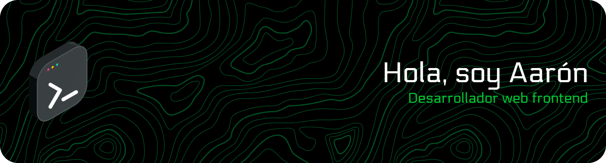

  

  

## <b> Tecnologías y herramientas</b>
<table align="center">
  <tr>
    <td align="center" width="50%">
      <strong>🌐 Lenguajes</strong>  
        
    </td>
    <td align="center" width="50%">
      <strong>⚛️ Frameworks y librerías</strong>  
        
    </td>
  </tr>
  <tr>
    <td align="center" width="50%">
      <strong>🧪 Testing</strong>  
        
    </td>
    <td align="center" width="50%">
      <strong>🛠️ Herramientas</strong>  
        
    </td>
  </tr>
</table> 

## <b> Estadisticas de Github </b>

    
    

 

## <b> Trofeos Github</b>
  

## <b> Citas random</b>
  

  Hecho con 💚 por <a href="https://github.com/Aaron-GF">@Aaron-GF</a>

  

